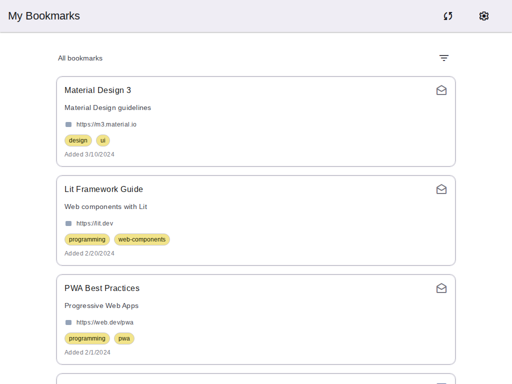
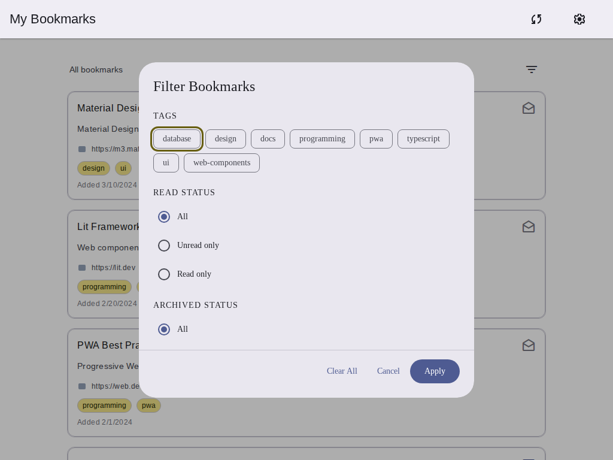
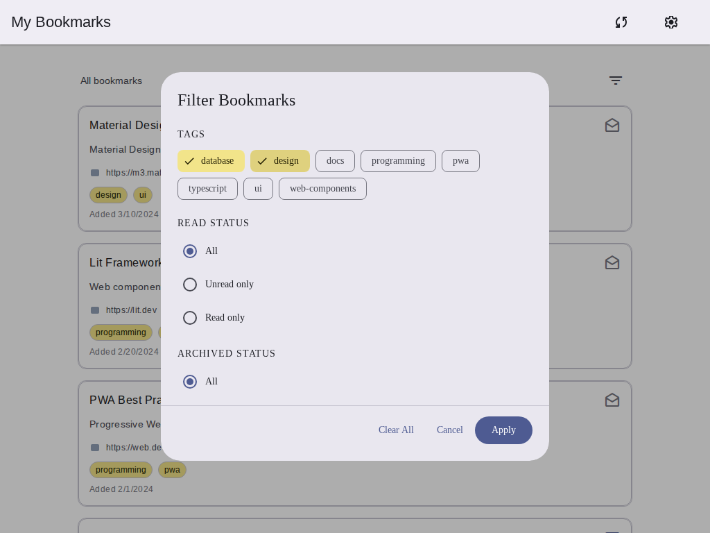
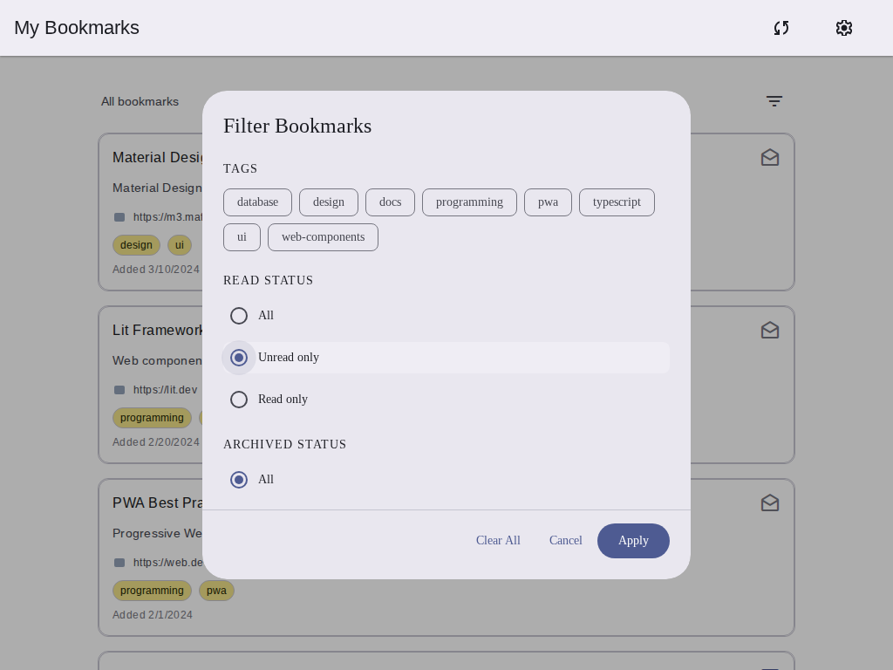
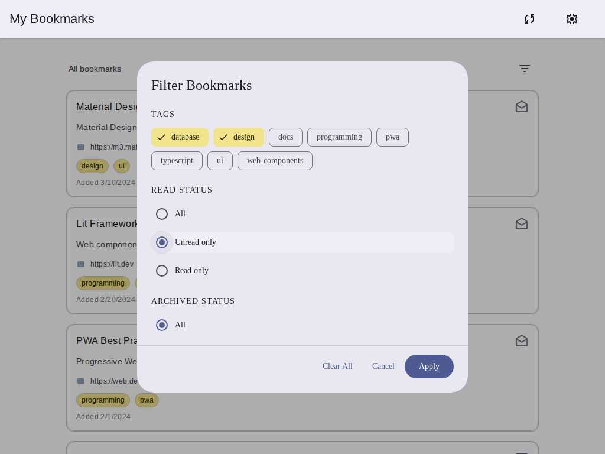
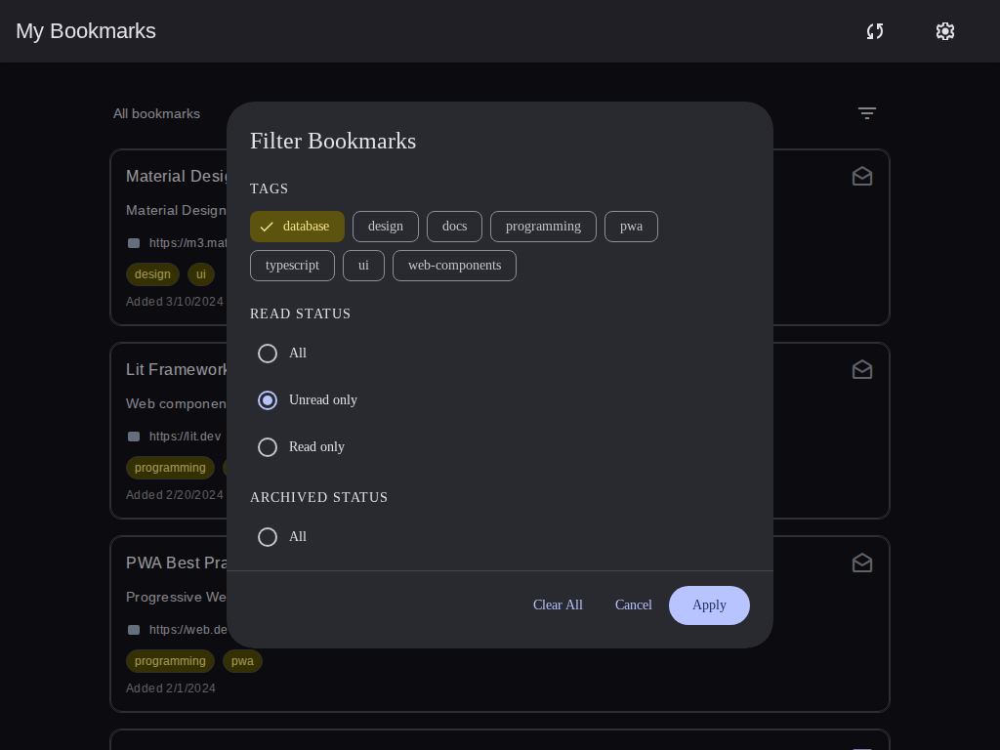
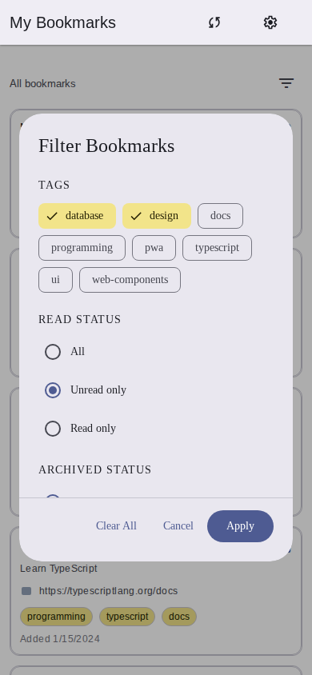
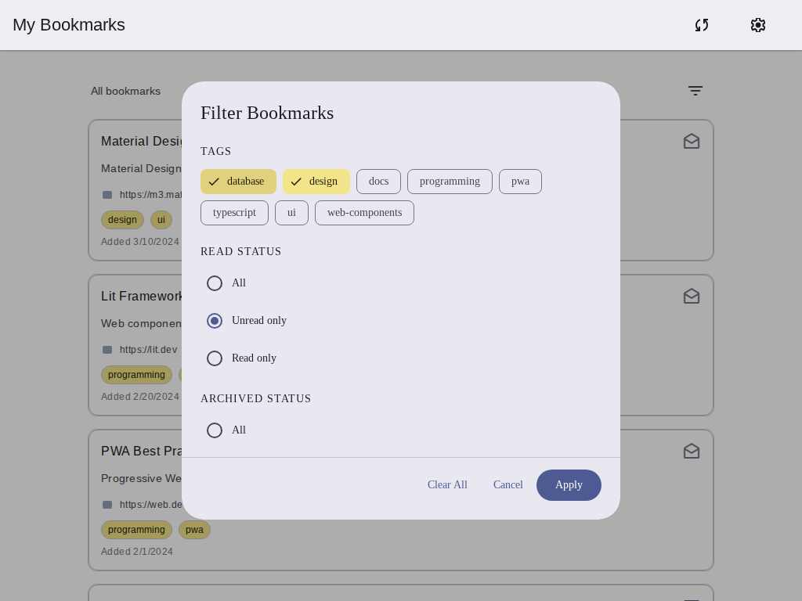

## 📸 Feature Screenshots

Here are visual demonstrations of the new advanced bookmark filtering feature:

### 1. Initial Bookmark List

*Bookmark list before applying any filters*

### 2. Filter Dialog - Overview

*Complete filter dialog showing all available filtering options*

### 3. Tag Filtering

*Multiple tags selected using Material Design filter chips*

### 4. Read Status Filtering

*Radio button options for filtering by read status (All/Unread only/Read only)*

### 5. Date Range Filtering

*Date range filtering section with preset options*

### 6. Applied Filter Summary

*Filter summary bar displayed after applying filters*

### 7. Filtered Results

*Bookmark list showing only items matching the active filters*

### 8. Dark Mode Support

*Filter dialog with dark mode theme applied*

### 9. Mobile Responsive Design

*Filter dialog optimized for mobile devices (390x844px viewport)*

### 10. Clear Filters

*"Clear All" button to quickly reset all active filters*

---

**Testing Notes:**
- All screenshots captured using Playwright on Chromium
- Demonstrates Material Design 3 components
- Showcases responsive design across desktop (1024x768) and mobile (390x844) viewports
- Dark mode support confirmed working
